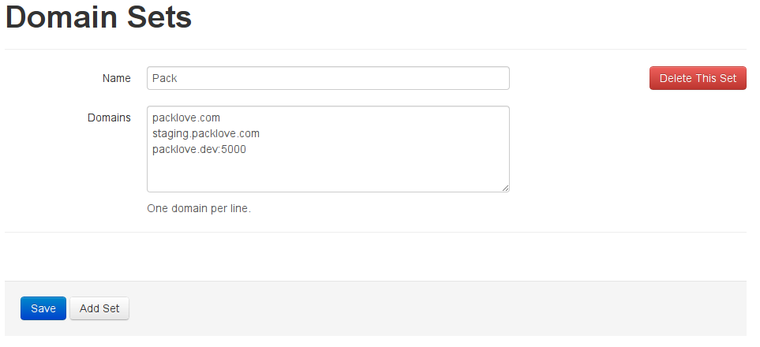
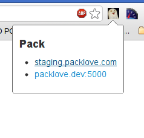

> Anyone know of a Chrome extension that keeps the current path but toggles through a list of development/test/staging domains?
>
> [@zachleat](https://twitter.com/zachleat/status/337631500931588096)

No, but we can build one!

# Status

This is not complete, it's not efficient, but it works.

# Usage

1. Clone this repo
1. Add the google-chrome-domain switcher as an unpacked extension from [chrome://extensions](chrome://extensions)
1. Visit the options page
1. Add a domain set and save it
    
   
1. Visit one of the sites in the domain set
1. Click the button
    
   
1. Use the links to jump to another domain with the same path
1. Find some bugs, or clean up the code, then open a pull request
